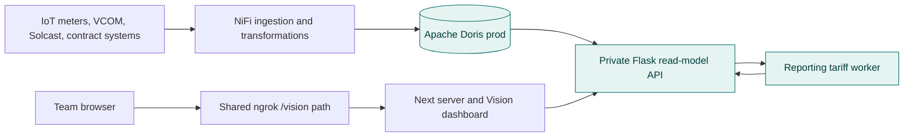
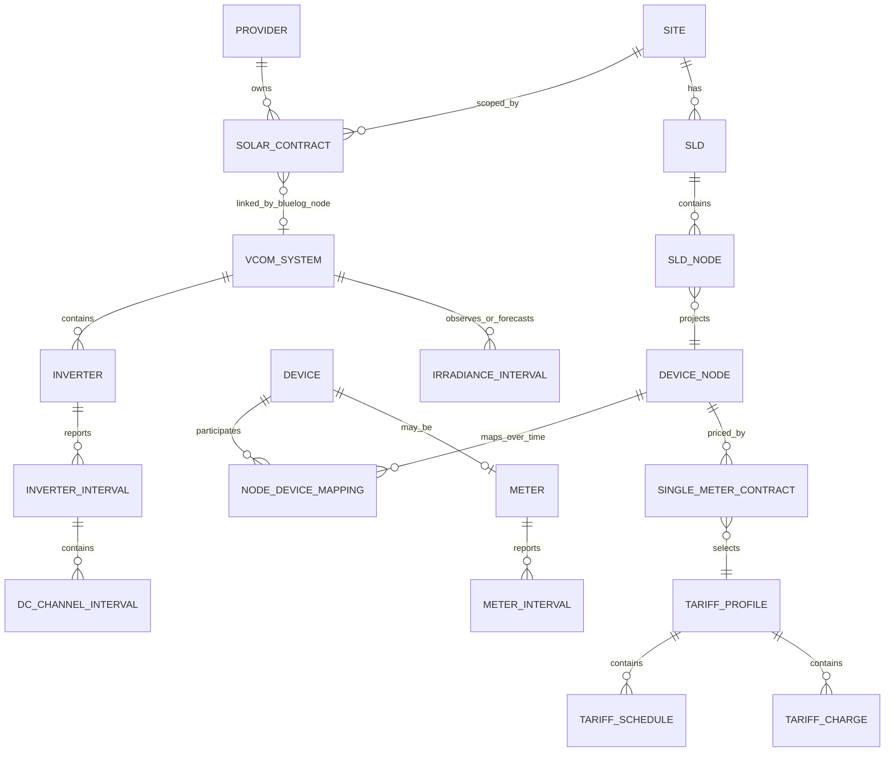

# Doris data architecture for Vision Energy Operations

Status: current-state map and target architecture
Validated: 11 September 2026
Scope: the Terradew Four portfolio, site, node, meter, solar, inverter, MPPT, string, irradiance, and financial views used by this application

## Executive summary

The application currently has a sound security boundary: the browser calls same-origin Next routes, the Next server calls a private Flask service, and only that service connects to Apache Doris. The main architectural weakness is not connectivity; it is that source selection, hierarchy mapping, aggregation, provenance, and financial calculation are combined inside request handlers and frontend transformations.

The target architecture should make Doris the analytical system of record, introduce a small canonical energy semantic layer, and serve versioned read models to the UI. Every value returned to the UI must carry enough metadata to answer four questions: what asset or contract does it belong to, what time window does it cover, what unit and aggregation does it use, and is it measured, calculated, forecast, or priced?

The highest-priority corrections are:

1. Replace the hard-coded PreCool catalog and telemetry mappings with contract- and device-node-based mappings from Doris.
2. Normalise the wide VCOM DC columns into MPPT and string interval records before the UI consumes them.
3. Calculate coincident site demand from aligned interval readings instead of summing independent meter peaks.
4. Use effective-dated device mappings and calculated interval views for meter energy; do not rely on a simple first/last register subtraction for report-grade results.
5. Separate municipal invoice cost, solar PPA value, avoided municipal cost, feed-in revenue, and net savings. They are different financial facts.
6. Publish source watermarks, coverage, quality flags, and derivation labels with every response.

## Evidence and authority

This document is based on the current application queries, the reporting tariff and virtual-meter implementations, the reporting architecture/glossary, and a read-only `DESCRIBE` inventory of the live `prod` Doris database on 11 September 2026. The canonical Doris catalog paths referenced by the reporting repository were not present on this workstation, so the live schema was used to validate relation and column names. Source units and business sign conventions that are not encoded in the schema remain explicit confirmation items below.

Authority by concern:

| Concern | Authority |
| --- | --- |
| Solar contract and commercial attributes | `prod.mv_contracts_solar` |
| Single-meter contract and tariff assignment | `prod.mv_contracts_single_meter` |
| Site electrical hierarchy | `prod.sld` and `prod.sld_device_nodes` |
| Effective device-to-node mapping | `prod.device_nodes_devices` with `prod.device_nodes` and `prod.devices` |
| Meter identity and descriptive metadata | `prod.mv_device_electricity_meters` |
| Raw meter telemetry and registers | `prod.electricity_energy_power` |
| Calculated meter intervals and historical demand | `prod.v_electricity_energy_power_30_calculated`, `prod.v_electricity_energy_power_day_calculated`, and `prod.v_electricity_energy_power_month_calculated` |
| VCOM system identity | `prod.mv_device_bluelogs` joined to `prod.vcom_systems` |
| Inverter metadata and telemetry | `prod.vcom_inverters` and `prod.vcom_inverter_data` |
| Observed irradiance | `prod.vcom_sensor_data` |
| Forecast/weather irradiance | `prod.solcast_data` |
| Tariff configuration and VAT | the `prod.mv_tariff_*` and `prod.mv_tax_profiles` views |
| Pricing semantics | the reporting worker's Single Meter and Tariff Pricing domain services |

## Current runtime and data flow



Current request path:

1. The browser requests `/api/contracts`, `/api/site`, `/api/precool`, or `/api/precool/telemetry` from the same origin.
2. The Next route validates query parameters and proxies to `DORIS_API_BASE_URL`. Doris credentials never enter the browser bundle.
3. Flask opens a read-only-style PyMySQL session to Doris using the five `DB_*` environment variables.
4. The contract catalog maps a solar contract to a site, SLD hierarchy, device nodes, meters, and VCOM `system_key`.
5. The site request queries meter, inverter, Solcast, and sensor data and builds a dashboard-shaped payload in memory.
6. Municipal financials start a reporting-worker subprocess, resolve the municipal Device Node to one active Single Meter contract, load its virtual-meter period, and run the tariff engine.
7. Docker exposes the web and API only on loopback. The shared Nginx proxy exposes the `web-shared` service at `/vision`; the API remains on an internal Docker network.

## Module and caller map

| Module | Responsibility | Called by |
| --- | --- | --- |
| `backend/contracts.py` | Contract catalog, hierarchy construction, source queries, site aggregation | Flask `/api/contracts` and `/api/site` |
| `backend/app.py` | Doris connection, date validation, legacy PreCool queries, inverter telemetry, Flask routes | Next proxy routes |
| `backend/reporting_financials.py` | Municipal Device Node to Single Meter contract resolution and tariff-worker bridge | `/api/site` |
| `app/api/contracts/route.ts` | Same-origin contract proxy; five-minute private cache header | Dashboard catalog loader |
| `app/api/site/route.ts` | Validated contract and date-range proxy | Contract-backed site views |
| `app/api/precool/route.ts` | Legacy PreCool date-range proxy | PreCool-specific view path |
| `app/api/precool/telemetry/route.ts` | Legacy inverter-code telemetry proxy | PreCool inverter view |
| `lib/portfolio-data.ts` | Portfolio types and a large static fallback catalog | Navigation and site selection |
| `lib/precool-period.ts` | Client-side date-range resampling and period totals | Dashboard charts and cards |
| `lib/period-resolution.ts` | Shared range-to-granularity rules | All chart views |
| `lib/inverter-analytics.ts` | Energy, cumulative, and heatmap projections | Inverter Total and inverter views |
| Reporting `single_meter_period` | Effective mapping, physical intervals, register boundaries, coverage | Municipal financial bridge |
| Reporting `virtual_meter` | GROSS/NET virtual-meter calculation and evidence | Single Meter period and pricing |
| Reporting `single_meter_pricing` and `tariff_pricing` | Tariff configuration, classification, demand history, calculation, evidence | Municipal financial bridge |

## Canonical domain model



Canonical identifiers:

| Identifier | Meaning | Rules |
| --- | --- | --- |
| `contract_id` | Commercial contract identity | Primary dashboard scope. Never infer it from a display name. |
| `site_id` | Physical site identity | A site may have multiple contracts/phases. Do not use it as a contract surrogate. |
| `device_node_id` | Logical electrical point or virtual total | Stable semantic node. Its contributing devices can change over time. |
| `sld_node_id` | Placement of a Device Node in an SLD | Used only for hierarchy and parentage. |
| `device_id` | Physical/registered device identity | Joined to effective node mappings. |
| `meter_serial` | Telemetry key for electricity facts | Normalise as trimmed text; never coerce to a number. |
| `system_key` | VCOM/Solcast system key | Obtained through the contract's BlueLog total Device Node, not guessed from project code. |
| `inverter_id` | VCOM inverter identity within a system | Canonical key is `(system_key, inverter_id)`. Display codes such as `07` are labels, not identities. |
| `sensor_id` | VCOM sensor identity within a system | Canonical key is `(system_key, sensor_id)`. |
| `tariff_profile_id` | Tariff configuration identity | Must be resolved from the active Single Meter contract for the selected period. |

The navigation label is `project_code | site_name | Phase n`, with the phase suffix omitted for phase 1. Duplicate site names therefore remain distinguishable by contract.

### Logical total nodes

The UI exposes four important logical totals. Their provenance must be returned explicitly.

| Node | Preferred definition | Fallback | Required provenance |
| --- | --- | --- | --- |
| Municipal Total | Effective physical meters mapped to `municipal_total_device_node_id` | None for report-grade financials | `metered` or `unavailable` |
| Solar Total | Effective physical meters mapped to `solar_total_device_node_id` | Sum child solar meters | `metered` or `calculated` |
| Load Total | Effective physical meters mapped to `load_device_node_id` | `grid import + solar production - grid export` | `metered`, `virtual`, or `calculated` |
| Site Total | Coincident facility demand at the selected interval | Aligned Municipal Total plus Solar Total under the confirmed sign convention | `calculated` plus input lineage |

A logical Device Node is valuable even when it is virtual. The API must not omit virtual load or total nodes; it must identify their calculation mode and contributing mappings.

## Doris source catalog

### Contracts, topology, and asset identity

| Relation | Grain/key | Fields used by this domain | Purpose |
| --- | --- | --- | --- |
| `mv_contracts_solar` | One solar contract; `contract_id` | Contract/site/provider identity, phase, dates, PPA and municipal rates, system sizes, yield/PR guarantees, export/demand flags, PLD/BESS/roof-rental fields, total Device Node IDs, BlueLog total node | Portfolio membership, commercial context, node roles, solar financial policy inputs |
| `mv_contracts_single_meter` | One Single Meter contract; `contract_id` | Site and Device Node, calculation mode, payer, tariff profile/currency, escalation, validity, annuity, NMD | Municipal billing scope and tariff selection |
| `sld` | One single-line diagram; `id` | `site_id`, `name` | Associates an electrical diagram with a site |
| `sld_device_nodes` | One node placement; `id` | `sld_id`, `device_node_id`, `parent_node_id` | Provides parent/child topology for navigation |
| `device_nodes` | One logical node; `id` | Site, type, name, identifier, `calc_mode` | Canonical logical electrical scope, including virtual nodes |
| `devices` | One physical/registered device; `id` | Identifier and type | Physical asset identity |
| `device_nodes_devices` | One effective-dated mapping; `id` | Device Node, device, multiplier, `valid_from`, `valid_to` | Correctly resolves changing meters and multipliers for any selected period |
| `mv_device_electricity_meters` | One meter/device projection | Meter serial, Device Node, calculation mode, site, status, source, manufacturer/model, CT/VT ratios, breaker, NMD, validity metadata | Descriptive metadata and current projection. It is not a replacement for effective-dated mapping logic. |
| `v_device_node_meter_availability` | One Device Node mapping | First/last datapoint, mapping validity, first reliable timestamp | Determines whether a mapping can support the selected window |
| `mv_device_bluelogs` | One Device Node/BlueLog bridge | `device_node_id`, `system_key`, site/system metadata | Connects a solar contract's BlueLog total node to VCOM |
| `vcom_systems` | One VCOM system; `system_key` | Name/location, UTC offset, currency, forecast flag, nominal/max AC power, commission date, active status | VCOM system metadata and operating context |

### Electricity metering

| Relation | Grain/key | Measures | Use |
| --- | --- | --- | --- |
| `electricity_energy_power` | Meter reading keyed by `meter_serial`, `timestamp`, and month bucket | Cumulative `import_wh`, `export_wh`, reactive quadrant registers, `ah`, `vah`, `ptot`, `qtot`, `stot`, `pftot`, source diagnostics | Five-minute operational charts and exact boundary markers |
| `v_electricity_energy_power_30_calculated` | Meter and 30-minute bucket | Cumulative registers, interval differences, active/reactive/apparent power, reading count | Canonical tariff and virtual-meter interval input |
| `v_electricity_energy_power_day_calculated` | Meter and local day | Register differences, power, daily apparent-power peak and timestamp | Daily summaries and historical demand |
| `v_electricity_energy_power_month_calculated` | Meter and local month | Register differences, power, monthly apparent-power peak and timestamp | Monthly summaries and demand charge history |

Use the calculated views for interval energy and pricing because they carry register differences and reactive quantities. Raw first/last subtraction is acceptable only for a clearly labelled operational estimate. It does not by itself handle device changes, resets, duplicated reads, reliability cutovers, or mapping multipliers.

### Inverters, DC channels, and irradiance

| Relation | Grain/key | Measures | Use |
| --- | --- | --- | --- |
| `vcom_inverters` | `(system_key, inverter_id)` | Model, vendor, serial, name, scale factor, firmware | Inverter dimension |
| `vcom_inverter_data` | `(system_key, inverter_id, timestamp)`; 236-column wide fact | AC/DC power, energy registers, state/errors, AC measurements, MPPT current/voltage families, string-current families | Inverter power/energy, MPPT telemetry, string diagnostics, heatmap |
| `vcom_sensor_data` | `(system_key, sensor_id, timestamp)` | `SRAD`, temperatures, environmental and communications fields | Observed irradiance and sensor health |
| `solcast_data` | `(system_key, period_end)` | GHI/DNI/DHI/GTI, cloud opacity, weather variables, forecast period | Modeled irradiance and expected-generation input |

The live VCOM fact has 236 columns. It includes direct MPPT pairs such as `I_DC1`/`U_DC1` and 70 string-current columns such as `I_DC1_1`. The current telemetry adapter discovers only names matching `I_DC<n>` and `U_DC<n>` and keeps their intersection. It therefore provides MPPT telemetry but does not model the `I_DC<mppt>_<string>` family. The current frontend also contains static PreCool inverter/string configuration. Those values must be treated as fallback configuration, not live Doris telemetry.

The target DC channel projection must be long-form:

| Field | Meaning |
| --- | --- |
| `system_key`, `inverter_id`, `observed_at` | Parent interval identity |
| `channel_kind` | `mppt` or `string` |
| `mppt_index` | MPPT number |
| `string_index` | String number; null for MPPT totals |
| `current_a` | Measured current |
| `voltage_v` | Measured voltage when available at the same electrical grain |
| `power_kw` | Source power or derived `current_a * voltage_v / 1000`, with a derivation flag |
| `source_columns` | Original wide-column names used |
| `quality_state` | Good, stale, missing, invalid, or configuration mismatch |

Do not assign an MPPT voltage to each string or calculate string power until the electrical meaning of the VCOM columns is confirmed.

### Tariff configuration

| Relations | Purpose |
| --- | --- |
| `mv_tariff_profiles` | Tariff identity, provider, currency, and tariff type |
| `mv_tariff_seasons` | Effective tariff schedule periods |
| `mv_tariff_classifications` | Weekday/minute season and time-of-use classification |
| `mv_tariff_season_classifications`, `mv_tariff_tou_classifications` | Classification names |
| `mv_tariff_weekday_overrides` | Holiday/calendar substitute-weekday rules |
| `mv_tariff_charges` | Rates, seasonal/TOU applicability, and block bounds |
| `mv_tariff_charge_profiles`, `mv_tariff_charge_categories`, `mv_tariff_charge_units` | Charge meaning, category, and quantity/rate unit |
| `mv_tariff_rule_charges`, `mv_tariff_rules` | Demand, minimum, bill-count, and other rule configuration |
| `mv_tax_profiles` | Effective-dated VAT by currency and tax code |

Tariff pricing must remain in the reporting domain service. The dashboard should consume its typed result and evidence rather than reproduce tariff rules in TypeScript or Flask.

## Metric and unit contract

The Doris schema stores numeric types but does not encode engineering units. The following contract reflects current application behavior and must be confirmed against upstream ingestion before it becomes canonical.

| Metric | Current interpretation | Display/aggregation rule | Status |
| --- | --- | --- | --- |
| `import_wh`, `export_wh` | Cumulative Wh registers | Interval energy from validated differences; convert Wh to kWh/MWh | Strongly supported by names and reporting code |
| `q1_varh`–`q4_varh` | Cumulative reactive-energy quadrant registers | Normalise invalid negative differences according to pricing policy | Strongly supported |
| `ptot` | Active power in W | Divide by 1,000 for kW; interval mean for profiles | Confirm source unit/sign |
| `qtot` | Reactive power in var | Divide by 1,000 for kvar; preserve sign | Confirm source unit/sign |
| `stot` | Apparent power in VA | Divide by 1,000 for kVA; retain timestamp of coincident peak | Confirm source unit/sign |
| `pftot` | Total power factor | Dimensionless; never average without an approved weighting rule | Confirm sign convention |
| `P_AC`, `P_DC` | Inverter power in W | Divide by 1,000 for kW; mean within profile buckets | Current adapter assumption |
| `E_DAY`, `E_TOTAL` | Inverter energy in kWh | `E_DAY` max per inverter/day; `E_TOTAL` last valid value with replacement/reset handling | Current adapter assumption |
| `I_DC<n>` | MPPT current in A | Mean within bucket; latest value for health card | Supported by naming |
| `U_DC<n>` | MPPT voltage in V | Mean within bucket; latest value for health card | Supported by naming |
| `I_DC<n>_<m>` | String current in A | Latest/profile value after normalisation | Supported by naming; not yet consumed |
| `SRAD` | Observed irradiance, expected W/m² | Mean for interval, integrated for irradiation | Confirm source unit |
| `ghi` | Forecast GHI, expected W/m² over a 30-minute period | Integrate using the row's `period`; do not hard-code 0.5 hours if periods vary | Confirm source unit; period exists |

Every API series should declare `metric`, `unit`, `statistic` (`mean`, `sum`, `max`, `last`, or `delta`), `interval`, and `provenance`.

## Time architecture

Doris telemetry timestamps are UTC. Use half-open intervals for Doris queries: `[window_start_utc, window_end_utc)`. The UI captures an inclusive SAST date and minute range; the backend adds one minute to its selected end, converts both boundaries to UTC, and queries Doris with those UTC-naive values.

Canonical policy:

- Business timezone: `Africa/Johannesburg` unless a validated site-specific IANA timezone overrides it.
- Query input: UI dates and times are SAST. Default full-day selections are `00:00` through `23:59` SAST.
- Doris storage: telemetry timestamps are UTC and must never be bucketed as local wall time.
- API output: timestamps, source watermarks, and chart bucket instants are emitted as SAST ISO-8601 values with `+02:00`; range metadata includes `timeZone: Africa/Johannesburg`.
- Solcast semantics: `period_end` is the end of a 30-minute measurement period. Subtract 30 minutes before chart alignment, then convert the resulting interval start from UTC to SAST.
- Selected end minute: include it by querying to one minute after it; a selection of `10:00`–`10:30` maps to `[08:00, 08:31)` in Doris UTC.
- Storage timestamps: retain source timestamps unchanged; timezone conversion is a read-model concern.
- Calendar aggregation: shift UTC telemetry by two hours before calculating day/month/year buckets. For Solcast day buckets, use the shifted interval start (`period_end + 90 minutes`).
- Latest cards: use the latest complete five-minute timestamp available for that source and selection; expose `observedAt` and `ageSeconds`.
- Never infer completeness solely from the requested end time. Compare source watermarks and expected cadence.

Chart resolution policy used by every graph:

| Inclusive range | Resolution | Chart form | Statistic |
| --- | --- | --- | --- |
| 1 day | 5 minutes | Line/area | Interval mean power; interval energy where requested |
| 2–4 days | 30 minutes | Line/area | Interval mean power; interval energy where requested |
| 5–14 days | 1 hour | Line/area | Interval mean power; interval energy where requested |
| 15–31 days | 1 day | Bars | Daily energy or daily coincident peak, depending on metric |
| 32–366 days | 1 month | Bars | Monthly energy or monthly coincident peak |
| More than 366 days | 1 year | Bars | Annual energy or annual coincident peak |

The current generic site backend switches from raw to daily data after 14 days, while the frontend groups daily points into month/year buckets. The target API should choose Doris's 30-minute/day/month source views directly and return the final requested grain so aggregation logic is not split across Python and TypeScript.

## Transformation and calculation rules

### Meter series

1. Resolve the contract and selected logical Device Node.
2. Resolve all physical meter mappings that overlap the requested window using `[valid_from, valid_to)` and their multipliers.
3. Intersect each mapping with data availability and `first_reliable_timestamp`.
4. Load the smallest Doris aggregate that preserves the requested statistic.
5. Apply GROSS/NET virtual-meter semantics through the reporting virtual-meter service.
6. Align contributing meters by interval before totals, maximum demand, or phase balance are calculated.
7. Return gaps as gaps with quality flags. Do not silently convert missing telemetry to zero.

### Power and energy

- Power profile: interval mean `ptot` in kW.
- Apparent power profile: interval mean `stot` in kVA.
- Energy: validated `import_diff_wh`/`export_diff_wh`, summed over the requested bucket.
- Maximum demand: maximum of the aligned aggregate series, retaining the timestamp. Never sum each meter's independent maximum.
- Site load: use the physical Load Total if available; otherwise calculate the virtual balance and label it.
- Apparent-power totals require an approved electrical rule. A simple sum of `stot` can be invalid when direction or phase relationships differ.

### Solar and inverter performance

- Metered production is the Solar Total meter energy and remains distinct from inverter `E_DAY` energy.
- Expected production should use a versioned model input, not an unexplained constant performance factor. At minimum record capacity, irradiance source, PR/loss factor, and model version.
- Performance ratio uses metered production, installed DC capacity, and integrated plane/irradiance input with compatible units.
- Inverter heatmaps use aligned intervals, one row per inverter, and a stated metric such as AC power, normalised yield, availability, or DC current. Missing intervals must not render as zero production.
- Cumulative inverter energy must account for device replacement and counter resets before summing `E_TOTAL` across assets.

### Financial facts

Municipal financials already use the correct domain boundary: one active Single Meter contract, its virtual-meter period, an effective tariff snapshot, historical demand, and VAT. The pricing result includes import/export energy, peak demand and time, charge categories, subtotal, VAT, total, readiness, reason codes, source contract, and tariff identity.

Solar financials require separate facts:

| Fact | Definition |
| --- | --- |
| Solar PPA value | Metered eligible solar kWh × effective contract PPA rate |
| Actual municipal cost | Tariff-engine result for actual municipal intervals |
| Counterfactual municipal cost | Tariff-engine result for approved no-solar baseline intervals |
| Avoided municipal cost | Counterfactual municipal cost − actual municipal cost |
| Feed-in benefit | Eligible exported energy × effective feed-in rule/rate |
| Demand benefit | Difference in demand charges only when the tariff policy and baseline support it |
| Net energy benefit | Avoided municipal cost + feed-in benefit − PPA payment, with other policy items stated separately |

The current `solar energy × current PPA rate` card is a PPA value estimate. It must not be labelled invoice, savings, or avoided cost. Report-grade results should be immutable pricing snapshots keyed by contract, period, pricing logic version, tariff configuration hash, data watermark, and run ID.

## API architecture

### Current endpoints

| Endpoint | Scope | Notes |
| --- | --- | --- |
| `GET /api/contracts` | Terradew Four contract catalog and navigation | Rebuilds hierarchy from Doris; Next response advertises a five-minute private cache |
| `GET /api/site?contract_id&from&to` | Generic contract-backed site data and municipal financials | Correct strategic route, but returns a large dashboard-specific payload |
| `GET /api/precool?from&to` | Legacy PreCool site data | Hard-coded system key, meter serials, capacity, and tariff |
| `GET /api/precool/telemetry?from&to&inverter` | Legacy PreCool MPPT telemetry | Inverter display code is used as lookup; not contract-generic and does not expose strings |

### Target endpoints

Introduce versioned resources while keeping the browser on same-origin routes:

```text
GET /api/v1/portfolio
GET /api/v1/contracts/{contractId}/topology
GET /api/v1/contracts/{contractId}/summary?from=&to=
GET /api/v1/nodes/{deviceNodeId}/series?from=&to=&metrics=ptot,stot,energy
GET /api/v1/contracts/{contractId}/inverters
GET /api/v1/inverters/{systemKey}/{inverterId}/series?from=&to=&metrics=ac_power,dc_power,energy
GET /api/v1/inverters/{systemKey}/{inverterId}/dc-channels?from=&to=&kind=mppt|string&metrics=current,voltage,power
GET /api/v1/contracts/{contractId}/irradiance?from=&to=&source=observed|solcast
GET /api/v1/contracts/{contractId}/financials?from=&to=&view=municipal|solar|combined
```

Common response envelope:

```json
{
  "scope": { "contractId": "...", "deviceNodeId": "..." },
  "window": { "from": "...", "toExclusive": "...", "timeZone": "Africa/Johannesburg" },
  "resolution": { "grain": "5min", "chart": "area" },
  "series": [],
  "totals": {},
  "sources": [{ "relation": "prod.electricity_energy_power", "watermark": "...", "expectedCadenceSeconds": 300 }],
  "quality": { "state": "complete", "coveragePercent": 99.8, "warnings": [] },
  "generatedAt": "...",
  "schemaVersion": "1"
}
```

The backend owns mapping, units, aggregation, financial semantics, and provenance. The frontend owns only presentation, series visibility, and non-destructive formatting. It must not recalculate contract totals or silently substitute static production data when a live request fails.

## Quality, reconciliation, and observability

Minimum automated rules:

| Area | Rule |
| --- | --- |
| Contract | Exactly one requested solar contract; phase/site identity present; active-date policy explicit |
| VCOM bridge | At most one applicable `system_key` for the contract's BlueLog node, or an explicit ambiguity error |
| Device mapping | No overlapping mappings for the same physical contribution unless the calculation policy explicitly allows them |
| Meter identity | Non-empty trimmed serial; mapping validity overlaps requested window; multiplier present |
| Cadence | Expected versus received intervals calculated per physical mapping and source |
| Registers | Detect negative differences, resets, duplicates, and discontinuities; retain diagnostic source IDs/algorithms |
| Power | Reject non-finite values; preserve gaps; validate engineering bounds by meter/inverter model |
| Inverter | Metadata and telemetry identity agree; channel count changes become configuration events |
| Strings | Configured versus reporting strings reconciled separately; unreported strings are missing, not zero |
| Irradiance | Forecast and observed sources never merged without a source label; integration uses actual interval duration |
| Totals | Solar meter versus inverter energy variance reported; physical Load Total versus balance-derived load reconciled when both exist |
| Financials | Exactly one eligible Single Meter contract and tariff profile; all readiness blockers fail closed |

Expose structured telemetry for every backend request:

- correlation/request ID, endpoint, contract/site/node scope, date range, chosen source relation, and row counts;
- query duration and total request duration without SQL parameters or secrets;
- source watermarks and coverage percentages;
- pricing run ID, logic version, configuration hash, and readiness state;
- cache hit/miss and response schema version;
- metrics for Doris timeouts, empty-source results, ambiguous mappings, stale sources, and pricing failures.

## Security and access boundaries

- Doris stays private behind the VPN. Never expose port 9030 or the Flask API through ngrok.
- Use a dedicated least-privilege Doris service account restricted to the required `prod` relations.
- Keep credentials in environment/secret management; never persist them in the frontend, image layers, logs, Git, or response payloads.
- Expose only the same-origin web service through the shared proxy.
- Add team authentication/allowlisting and contract-level authorisation before treating the ngrok URL as a production sharing channel.
- Apply rate limits, request-size/date-range limits, and bounded query timeouts at the public edge and API.
- Redact meter serials and customer/commercial fields from logs where operational staff do not need them.
- Run dependency and image scanning and deploy immutable image versions for shared environments.

## Performance and caching

Current site requests synchronously load the contract catalog, telemetry, and a tariff-worker subprocess. This is workable for a prototype but will not scale across a portfolio.

Recommended policy:

| Data | Strategy |
| --- | --- |
| Contract/topology catalog | Cache for five minutes and invalidate on the latest relevant `last_update` watermark |
| Current five-minute telemetry | Cache for 30–60 seconds, keyed by contract/node/inverter and latest source watermark |
| Completed historical intervals | Cache by scope, window, metric, grain, semantic version, and source watermark |
| Daily/monthly/yearly charts | Query Doris aggregate views or materialised semantic aggregates, not raw five-minute scans |
| Municipal pricing | Move out of a per-request subprocess into a long-lived service or queued job; cache immutable Pricing Results |
| Portfolio summaries | Precompute daily contract/site facts and refresh incrementally |

Queries must filter on key/partition columns such as meter serial, system key, and time bucket. Limit the selected fields, cap range size, and avoid calculating the same hierarchy or tariff configuration for every chart request.

## Target Doris semantic layer

The proposed names describe responsibilities; they are not yet live relations.

| Target model | Grain | Inputs | Purpose |
| --- | --- | --- | --- |
| `sem_contract_asset_scope` | Contract × effective asset mapping | Solar contracts, SLD, Device Nodes, mappings, BlueLog bridge | One authoritative contract-to-node/meter/system map |
| `sem_meter_interval_5m` | Device Node × meter × five minutes | Raw electricity fact plus effective mappings | Normalised operational telemetry with quality/provenance |
| `sem_meter_interval_30m` | Device Node × meter × 30 minutes | Existing calculated view plus mappings | Virtual meter and tariff input |
| `sem_node_interval_5m` | Logical Device Node × five minutes | Normalised meter intervals | GROSS/NET/virtual node series |
| `sem_inverter_interval_5m` | System × inverter × five minutes | VCOM inverter fact and metadata | Canonical AC/DC/energy/status series |
| `sem_inverter_dc_channel_5m` | System × inverter × MPPT/string × five minutes | Normalised VCOM wide DC columns | MPPT and string charts/health |
| `sem_irradiance_interval` | System × source × interval | VCOM sensors and Solcast | Observed/forecast irradiance with period and units |
| `agg_contract_day` | Contract × local day | Node, inverter, irradiance semantics | Portfolio and site daily KPIs |
| `agg_contract_month` | Contract × local month | Daily aggregate | Long-range dashboard bars |
| `ops_source_watermark` | Source relation × scope | Ingestion audit | Freshness and staleness decisions |
| `ops_quality_event` | Scope × time × rule | Validation outputs | Explainable data-quality status |
| `fact_pricing_result` | Contract × period × run | Reporting pricing output | Immutable financial snapshot and audit evidence |

Keep the pricing engine's canonical configuration and arithmetic in the reporting service. Doris may store its input projections and immutable results, but a second SQL implementation of the tariff rules would create conflicting authorities.

## Delivery plan

### Phase 1 — Stabilise the current read model

- Publish a typed response envelope with source watermarks, provenance, units, quality, and schema version.
- Make `/api/site` the only site read path and pass `contract_id` into all inverter/DC queries.
- Remove production dependence on the static frontend portfolio and PreCool telemetry fixtures.
- Return virtual Load Total nodes even when no physical meter exists.
- Correct coincident peak calculations and distinguish missing from zero.
- Reuse the calculated 30-minute/day/month meter views for energy and long-range charts.

### Phase 2 — Normalise telemetry and hierarchy

- Build the contract-asset semantic scope using effective-dated mappings.
- Create long-form inverter MPPT/string projections and configuration reconciliation.
- Centralise resolution, timezone, unit, and sign policies in the backend domain layer.
- Add quality rules, watermarks, reconciliation, and observability dashboards.

### Phase 3 — Operationalise financials

- Run the reporting tariff domain as a service or worker job instead of a subprocess per HTTP request.
- Persist immutable municipal Pricing Results and evidence.
- Define and approve the no-solar baseline policy, then add solar PPA, avoided municipal cost, demand benefit, feed-in benefit, and net-benefit snapshots.
- Reuse approved report snapshots for official dashboard and PDF outputs.

### Phase 4 — Scale and govern

- Add Doris materialised aggregates for portfolio/day/month workloads after query profiling.
- Add contract-level access control, data-retention rules, lineage ownership, and schema-change checks.
- Version API and semantic contracts and test them against the live Doris catalog in CI.
- Replace the temporary ngrok sharing path with an authenticated, monitored Vision deployment when the dashboard moves beyond team preview.

## Confirmed and remaining decisions

These do not block the architecture but must be resolved before the relevant semantic model is declared authoritative:

1. **Confirmed:** Doris telemetry timestamps are UTC; Vision query ranges and display buckets use SAST.
2. Are `ptot`, `qtot`, and `stot` stored in W/var/VA, and what are the import/export sign conventions?
3. Are VCOM `P_AC`/`P_DC` in W and `E_DAY`/`E_TOTAL` in kWh for every inverter model and scale factor?
4. Does `SRAD` represent W/m² in the array plane, and should Solcast `ghi` or `gti` drive expected production?
5. What is the approved definition of Site Total: facility load, power supplied by grid plus solar, or a contract-specific node?
6. How must `stot` be combined across meters and phases for each topology?
7. Which VCOM voltage applies to each `I_DC<mppt>_<string>` current, if any?
8. Which solar contract validity dates and escalation rules make a PPA rate effective for a selected interval?
9. What approved baseline produces report-grade avoided municipal cost and demand savings?
10. Who owns resolution of overlapping contracts, Device Node mappings, or multiple BlueLog system keys?

Until these are confirmed, the API should label affected outputs as estimates or unavailable and include a reason code rather than silently applying a default.
